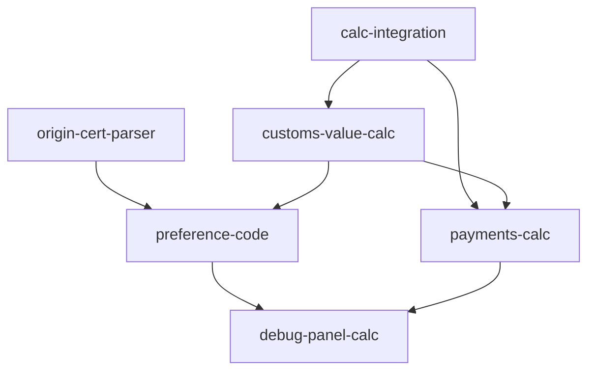

# Customs Calculations Pipeline

## Обзор

Автоматическое заполнение граф ДТ, которые требуют внешних данных (курсы ЦБ), расчётов (таможенная/статистическая стоимость) или парсинга дополнительных документов (сертификаты происхождения). Интеграция ai-service с calc-service.

## Текущее состояние

| Графа | Поле | Статус | Источник |
|-------|------|--------|----------|
| 23 | Курс валюты ЦБ | ❌ Не реализовано | calc-service → CBR API |
| 36 | Преференции (4 элемента) | ❌ Не реализовано | ТН ВЭД + calc-service + ПП РФ №1637 |
| 45 | Таможенная стоимость (руб.) | ❌ Не реализовано | Инвойс × курс + фрахт |
| 46 | Статистическая стоимость (USD) | ❌ Не реализовано | ТС / курс USD |
| 47/B | Платежи (пошлина, НДС, сборы) | ❌ Не реализовано | calc-service |

---

## 1. Интеграция с calc-service

**Файлы:**
- `services/ai-service/app/config.py` — добавить `CALC_SERVICE_URL`
- `docker-compose.yml` — переменная окружения
- `services/ai-service/app/services/agent_crew.py` — утилита `_fetch_exchange_rate()`

### Что делаем:

```python
# config.py
CALC_SERVICE_URL: str = "http://calc-service:8005"

# agent_crew.py
async def _fetch_exchange_rate(currency: str, date: str = None) -> dict:
    """Получить курс ЦБ через calc-service."""
    # GET /exchange-rates?currency={currency}&date={date}
    # Возвращает: {"currency": "USD", "rate": 92.50, "date": "2024-01-15"}
```

Существующие эндпоинты calc-service:
- `GET /exchange-rates` — курсы ЦБ
- `POST /payments/calculate` — расчёт платежей по HS-коду и ТС

---

## 2. Парсер сертификатов происхождения

**Файл:** `services/ai-service/app/services/llm_parser.py`

Тип `origin_certificate` уже добавлен в `classify_and_extract()` (в рамках LLM v3).

Извлекаемые поля:
- `certificate_type`: CT-1, Form A, EUR.1, Declaration of Origin
- `certificate_number`, `certificate_date`
- `issuing_country`, `country_origin`
- `exporter_name`
- `trade_agreement` (название соглашения)
- `items[]` — товары с country_origin

---

## 3. Расчёт таможенной и статистической стоимости

**Файл:** `services/ai-service/app/services/agent_crew.py` → `_post_process_compilation()`

### Графа 23 — Курс валюты

```
exchange_rate = _fetch_exchange_rate(currency, date=invoice_date)
```

### Графа 45 — Таможенная стоимость (руб.)

Для каждой позиции:
```
item_customs_value = item.line_total * exchange_rate
```

Фрахт распределяется пропорционально весу:
```
item_freight_share = total_freight * (item.gross_weight / total_gross_weight)
customs_value_rub = item_customs_value + item_freight_share
```

### Графа 46 — Статистическая стоимость (USD)

```
usd_rate = _fetch_exchange_rate("USD", date=invoice_date)
statistical_value_usd = customs_value_rub / usd_rate
```

---

## 4. Графа 36 — Преференции

**Файл:** `services/ai-service/app/services/agent_crew.py` → `_post_process_compilation()`

### Правила заполнения

Графа 36 состоит из **4 элементов** (кодов льгот по уплате таможенных платежей):

| Элемент | Вид платежа | Источник ставки |
|---------|-------------|-----------------|
| 1 | Таможенные сборы | ПП РФ от 28.11.2024 №1637 |
| 2 | Таможенная пошлина | Код ТН ВЭД → ЕТТ ЕАЭС (через calc-service) |
| 3 | Акциз | Код ТН ВЭД → НК РФ (через calc-service) |
| 4 | НДС | Код ТН ВЭД → НК РФ (через calc-service) |

### Логика заполнения каждого элемента

Каждый элемент — 2-значный код льготы из классификатора льгот по уплате таможенных платежей.

**Если ставка платежа для данного ТН ВЭД не установлена, либо не возникает обязанность по уплате** → элемент = `"-"`.

**Если льгота не применяется (полная уплата)** → элемент = `"ОО"` (без льгот).

**Если есть сертификат происхождения** — может применяться тарифная преференция (элемент 2):
- CT-1 (СНГ) → код `"ТП"` (тарифная преференция)
- Form A (развивающиеся страны) → код `"ТП"`
- EUR.1 (ЕАЭС/иные соглашения) → код по соглашению
- Нет сертификата → `"ОО"` (без льгот)

### Дефолт

```
preference_code = "ОО ОО - ОО"
```
(сборы — полная ставка, пошлина — полная, акциз — не установлен, НДС — полная)

При отсутствии данных для точного определения — добавить issue:
```python
issues.append({
    "id": "preference_check",
    "severity": "warning",
    "graph": 36,
    "message": "Проверьте преференции (гр.36). Коды льгот определены по умолчанию."
})
```

### Интеграция с calc-service

После получения ответа от calc-service (`/payments/calculate`):
- Если `duty_rate > 0` → пошлина установлена → элемент 2 = `"ОО"` (или `"ТП"` при наличии сертификата)
- Если `duty_rate == 0` или `null` → пошлина не установлена → элемент 2 = `"-"`
- Если `vat_rate > 0` → НДС установлен → элемент 4 = `"ОО"`
- Если `vat_rate == 0` или `null` → НДС не установлен → элемент 4 = `"-"`
- Акциз: для большинства товаров не установлен → элемент 3 = `"-"`

---

## 5. Графа 47/B — Платежи

**Файл:** `services/ai-service/app/services/agent_crew.py`

После HS Classification для каждой позиции:

```python
payments_response = calc_service.post("/payments/calculate", {
    "hs_code": item["hs_code"],
    "customs_value_rub": item["customs_value_rub"],
    "country_origin": item["country_origin_code"],
    "preference_code": item.get("preference_code"),
})
```

Результат добавляется в item:
```python
item["payments"] = {
    "duty": {"code": "2010", "rate": "5%", "amount": 12500.00},
    "vat":  {"code": "5010", "rate": "20%", "amount": 52500.00},
    "fee":  {"code": "1010", "rate": "по ПП №1637", "amount": 8530.00},
}
```

---

## 6. Обновление debug-панели

Добавить в `PostProcessStage`:
- Курс валюты (гр.23)
- Таможенная стоимость per-item (гр.45)
- Статистическая стоимость per-item (гр.46)
- Распределение фрахта
- Преференции (гр.36) — 4 элемента с пояснением
- Платежи (гр.47/B) — пошлина, НДС, сборы

---

## Зависимости



## Файлы, затрагиваемые изменениями

| Действие | Файл |
|----------|------|
| Обновить | `services/ai-service/app/config.py` |
| Обновить | `services/ai-service/app/services/agent_crew.py` |
| Обновить | `services/ai-service/app/services/llm_parser.py` (origin_certificate уже добавлен) |
| Обновить | `services/ai-service/app/routers/smart_parser.py` |
| Обновить | `frontend/src/pages/AdminParseDebugPage.tsx` |
| Обновить | `frontend/src/api/ai.ts` |
| Обновить | `docker-compose.yml` / `docker-compose.prod.yml` |
| Не трогать | `services/calc-service/` (уже реализован) |
