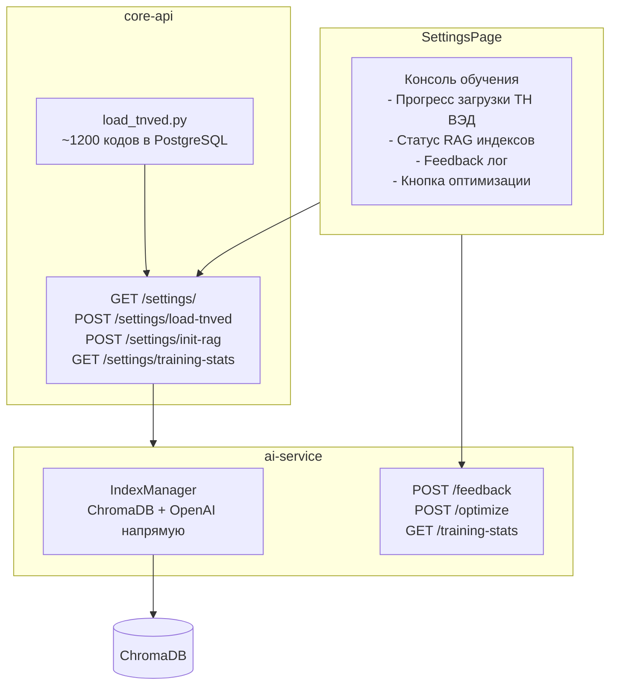

# RAG, ТН ВЭД и консоль обучения модели

## Проблемы

- **RAG не работает**: llama-index был убран из `requirements.txt` ai-service (вызывал бесконечный pip backtrack). ChromaDB запущен, но RAG отключён.
- **ТН ВЭД: 0 кодов**: seed-скрипт `load_tnved.py` существует но никогда не запускался.
- **Нет визуализации обучения**: feedback хранится только в памяти ai-service, нет UI для мониторинга.

## Архитектура решения

## Шаг 1: RAG без LlamaIndex

Перепишу `index_manager.py` — убрать LlamaIndex, использовать **chromadb + openai напрямую**:

- `chromadb` уже установлен в ai-service
- `openai` уже установлен — вызывать `openai.embeddings.create()` для text-embedding-3-small
- Три коллекции: `hs_codes`, `risk_rules`, `precedents`
- `search_hs_codes(description)` — embed description → chromadb query → top-10
- `add_precedent(description, hs_code)` — embed + add to `precedents` collection
- Файл: [services/ai-service/app/services/index_manager.py](services/ai-service/app/services/index_manager.py)

## Шаг 2: Загрузка ТН ВЭД

- Запустить `load_tnved.py` в core-api контейнере (вставит ~50000 кодов hs_code в classifiers)
- Добавить endpoint `POST /api/v1/settings/load-tnved` — триггер загрузки из UI
- Добавить endpoint `POST /api/v1/settings/init-rag` — отправит коды в ai-service для индексации в ChromaDB
- Файлы: [services/core-api/app/routers/settings.py](services/core-api/app/routers/settings.py)

## Шаг 3: Endpoint статистики обучения в ai-service

Новый endpoint `GET /api/v1/ai/training-stats`:

- Количество документов в каждой коллекции ChromaDB (hs_codes, risk_rules, precedents)
- Количество собранных feedback'ов
- Время последней оптимизации
- Статус DSPy модели (есть ли сохранённый оптимизированный модуль)
- Лог последних действий обучения
- Файл: [services/ai-service/app/routers/smart_parser.py](services/ai-service/app/routers/smart_parser.py)

Новый endpoint `POST /api/v1/ai/index-hs-codes` — принимает массив кодов и индексирует в ChromaDB.

## Шаг 4: Консоль обучения в Settings UI

Добавить на `SettingsPage.tsx` новый блок "AI Консоль":

- **Панель "База знаний ТН ВЭД"**:
  - Индикатор: N кодов в PostgreSQL / N кодов в ChromaDB
  - Кнопка "Загрузить ТН ВЭД" → `POST /settings/load-tnved`
  - Кнопка "Индексировать в RAG" → `POST /settings/init-rag`
  - Progress bar при загрузке
- **Панель "Обучение модели"**:
  - Счётчик feedback'ов (подтверждённых/исправленных кодов)
  - Счётчик прецедентов в ChromaDB
  - Кнопка "Запустить оптимизацию" → `POST /ai/optimize`
  - Индикатор: "Последняя оптимизация: дата" или "Оптимизация не выполнялась"
- **Панель "Лог обучения"** (консоль):
  - Прокручиваемый лог последних событий (загрузка, индексация, feedback, оптимизация)
  - Визуальный стиль monospace, как терминал
- Файл: [frontend/src/pages/SettingsPage.tsx](frontend/src/pages/SettingsPage.tsx)

## Шаг 5: Rebuild и проверка

- Rebuild ai-service (новый index_manager.py)
- Rebuild core-api (новые endpoints)
- Rebuild frontend (volume mount подхватит)
- Запустить загрузку ТН ВЭД + индексацию через UI
- Проверить что RAG поиск работает

