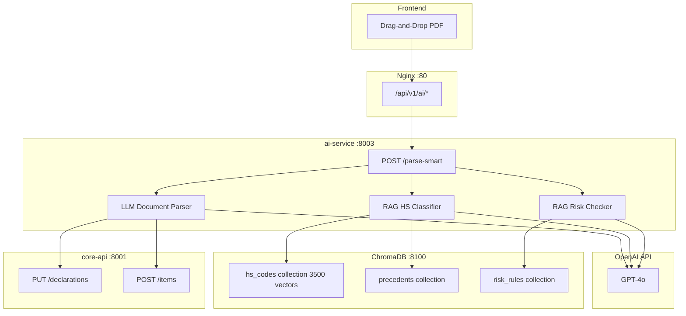

# Полный RAG: LLM парсинг + векторный ТН ВЭД + прецеденты + СУР

## Архитектура




## Что меняется

Текущий `ai-service` использует regex для парсинга PDF и словарь ключевых слов для ТН ВЭД. Заменяем на:

1. **LLM Parser** -- GPT-4o извлекает структурированные данные из любого формата инвойса с точностью 95-99%
2. **RAG HS Classifier** -- Векторный поиск по 3500 кодам ТН ВЭД вместо keyword matching. LLM выбирает точный 10-значный код с обоснованием
3. **RAG Risk Checker** -- База правил СУР в векторной БД, LLM анализирует декларацию и выдает предупреждения
4. **Precedent Learning** -- Каждая успешная декларация сохраняется как прецедент для будущих подсказок

## Файлы для создания/изменения

### 1. Инфраструктура

- **docker-compose.yml** -- добавить контейнер ChromaDB (порт 8100, volume `chromadata`)
- **.env** -- добавить `OPENAI_API_KEY`, `CHROMADB_HOST=chromadb`, `CHROMADB_PORT=8100`
- **[services/ai-service/requirements.txt](services/ai-service/requirements.txt)** -- добавить `openai`, `chromadb`, `langchain`, `tiktoken`

### 2. ai-service: LLM Document Parser

- `**services/ai-service/app/services/llm_parser.py**` (новый) -- основной LLM парсер:
  - Функция `parse_document_with_llm(text, doc_type)` -- отправляет текст в GPT-4o с промптом "извлеки JSON из инвойса"
  - Structured output через `response_format={"type": "json_object"}`
  - Промпт содержит схему всех полей декларации (графы 1-54)
  - Fallback на текущий regex-парсер если OpenAI недоступен
- `**services/ai-service/app/services/llm_client.py**` (новый) -- обертка OpenAI:
  - Singleton клиент, retry логика, rate limiting
  - Абстракция `LLMProvider` для будущего переключения на Anthropic/local

### 3. ai-service: RAG для ТН ВЭД

- `**services/ai-service/app/services/rag_classifier.py**` (новый) -- RAG классификатор:
  - При старте: загрузка 3500 кодов ТН ВЭД из PostgreSQL в ChromaDB (embeddings через OpenAI)
  - Функция `classify_hs_rag(description, context)`:
    1. Similarity search по ChromaDB -- top-10 похожих кодов
    2. Отправка в GPT-4o: "Из этих 10 кодов выбери правильный для товара: {description}"
    3. Возврат 10-значного кода с обоснованием и confidence
- `**services/ai-service/app/services/vector_store.py**` (новый) -- работа с ChromaDB:
  - `init_collections()` -- создание коллекций при старте
  - `upsert_hs_codes(codes)` -- загрузка ТН ВЭД
  - `search_similar(query, collection, top_k)` -- поиск

### 4. ai-service: RAG для СУР и прецедентов

- `**services/ai-service/app/services/rag_risk.py**` (новый) -- проверка рисков через RAG:
  - Коллекция `risk_rules` в ChromaDB с 50+ правилами СУР
  - Функция `check_risks_rag(declaration_data)`:
    1. Similarity search по декларации
    2. GPT-4o анализирует найденные правила применительно к декларации
    3. Возврат списка рисков с рекомендациями
- `**services/ai-service/app/services/precedent_store.py**` (новый) -- база прецедентов:
  - При каждом успешном выпуске декларации -- сохранение "описание товара -> код ТН ВЭД" в ChromaDB
  - При классификации -- сначала поиск по прецедентам, потом по справочнику

### 5. ai-service: Новые роутеры

- `**services/ai-service/app/routers/smart_parser.py**` (новый):
  - `POST /api/v1/ai/parse-smart` -- загрузка одного или нескольких PDF, автоопределение типа, LLM парсинг, создание декларации
  - `POST /api/v1/ai/classify-hs-rag` -- RAG классификация ТН ВЭД
  - `POST /api/v1/ai/check-risks-rag` -- RAG проверка рисков

### 6. ai-service: Скрипт инициализации

- `**services/ai-service/app/seeds/init_vectordb.py**` (новый):
  - Загрузка 3500 кодов ТН ВЭД из PostgreSQL в ChromaDB
  - Загрузка 50+ правил СУР в ChromaDB
  - Запускается при первом старте или по команде

### 7. Frontend

- **[frontend/src/api/ai.ts](frontend/src/api/ai.ts)** -- добавить `parseSmartDocument()` endpoint
- **[frontend/src/components/DocumentUploadPanel.tsx](frontend/src/components/DocumentUploadPanel.tsx)** -- обновить: поддержка мультизагрузки (несколько PDF одновременно), автоопределение типа документа

## Ключевые промпты для GPT-4o

**Парсинг инвойса:**

```
Ты — эксперт по таможенному оформлению РФ. Из текста документа извлеки данные в JSON.
Обязательные поля: invoice_number, date, seller (name, country, address), buyer (name, country, address),
currency, total_amount, incoterms, items [{description, quantity, unit, unit_price, total}],
country_origin.
```

**Классификация ТН ВЭД:**

```
Ты — таможенный классификатор. Для товара "{description}" из страны {country} выбери
правильный 10-значный код ТН ВЭД ЕАЭС. Вот похожие коды из справочника: {rag_results}.
Верни JSON: {hs_code, name_ru, reasoning, confidence}.
```

## Порядок реализации

1. ChromaDB в docker-compose + vector_store.py + init_vectordb.py
2. llm_client.py + llm_parser.py (замена regex на GPT-4o)
3. rag_classifier.py (ТН ВЭД через RAG)
4. rag_risk.py + precedent_store.py
5. smart_parser.py роутер (мультизагрузка PDF)
6. Frontend: обновление DocumentUploadPanel
7. Тестирование на реальных PDF из `dek/`

