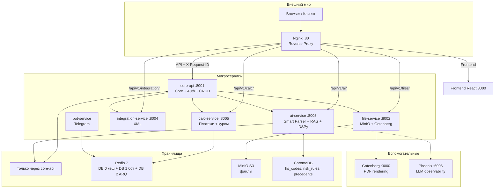

# Архитектура Digital Broker Platform

**Актуальное состояние на 21 марта 2026**

Документация основана на анализе реального кода (`docker-compose.yml`, `docker-compose.prod.yml`, `infrastructure/nginx/nginx.conf`, `services/*/app/main.py`, конфигурации и структуры проекта), а не на устаревших описаниях.

## 1. Обзор

Платформа — микросервисная система автоматизации таможенного оформления (цифровой брокер). Основной сценарий: загрузка пакета документов (PDF, Excel и др.) → AI-парсинг → формирование черновика таможенной декларации (ДТ) → валидация → применение правок пользователем → экспорт в XML/ФТС.

**Ключевые возможности:**
- Smart parsing документов (инвойсы, контракты, packing lists, транспортные, спецификации).
- RAG-подбор кодов ТН ВЭД (ChromaDB + DSPy).
- Правила заполнения (YAML + БД + текстовые правила).
- Evidence map + AI issues для traceability.
- Pre-send hard gate (блокирующие проверки).
- Расчёт платежей, интеграции, админка.

## 2. Высокоуровневая схема

## 3. Сервисы и их ответственность

### core-api (8001)
- **Основной API** для frontend и других сервисов.
- Авторизация (JWT + RBAC, 7 ролей, company filter).
- CRUD: декларации, позиции, документы, контрагенты, компании, пользователи.
- Применение AI-результата (`apply_parsed.py`).
- Управление правилами (`graph_rules`, `ai_strategies`).
- Админка, история кодов ТН ВЭД, аудит.
- Startup: синхронизирует LLM-настройки из БД в ai-service.

**Ключевые файлы:**
- `services/core-api/app/main.py`
- `services/core-api/app/routers/apply_parsed.py`
- `services/core-api/app/routers/graph_rules.py`
- Модели в `services/core-api/app/models/`
- Alembic миграции

### ai-service (8003) — самый сложный сервис
- Smart parsing (`smart_parser.py` + `agent_crew.py`).
- RAG (ChromaDB) + DSPy классификаторы.
- Rules engine (`rules_engine.py`, `declaration_mapping_v3.yaml`).
- LLM провайдеры (DeepSeek по умолчанию, OpenAI, Cloud.ru).
- Vision OCR (DeepSeek-OCR-2).
- Feedback loop и обучение.
- **ARQ task queue** — async обработка через `ai-worker` (Этап 1.1).

**Ключевые файлы:**
- `services/ai-service/app/main.py`
- `services/ai-service/app/services/agent_crew.py` (**монолит, ~3700 строк** — главный кандидат на рефакторинг)
- `services/ai-service/app/services/rules_engine.py`
- `services/ai-service/app/services/index_manager.py`
- `services/ai-service/app/services/dspy_modules.py`
- `services/ai-service/app/services/llm_parser.py`
- `services/ai-service/app/config.py` (Pydantic Settings с LLM/OCR)
- `services/ai-service/app/workers/tasks.py` (ARQ worker — фоновая обработка)

**Важные замечания по AI:**
- Основной путь — линейный pipeline в `DeclarationCrew.process_documents()`.
- При `TASK_QUEUE_ENABLED=true` — задача ставится в ARQ очередь (`ai_tasks` в Redis DB 2), выполняется `ai-worker`.
- Sync fallback (`TASK_QUEUE_ENABLED=false` или ошибка enqueue) — `process_documents()` запускается через `run_in_executor()`, чтобы не блокировать event loop и healthchecks.
- CrewAI загружается, но `_run_crewai` не используется в основном потоке.
- Правила берутся из 3 источников: YAML, БД, `docs/declaration_ai_filling_rules.md`.

### file-service (8002)
- Загрузка, хранение и обработка файлов (MinIO).
- Интеграция с Gotenberg для конвертации PDF.

### calc-service (8005)
- Расчёт таможенных платежей.
- Кэширование курсов ЦБ в Redis.

### integration-service (8004)
- Генерация и валидация XML для ФТС/Альта.

### bot-service
- Telegram-бот для клиентов.

## 4. Инфраструктура

**Docker Compose:**
- `docker-compose.yml` — dev (volume mounts для быстрой разработки).
- `docker-compose.prod.yml` — production (bridge network `customs-net`, restart policies, все порты закрыты кроме nginx:80, Redis с паролем).

**Healthchecks (Этап 1.2):**

Все сервисы имеют два эндпоинта:
- `GET /health` — liveness (всегда 200, если процесс жив).
- `GET /ready` — readiness (проверяет зависимости, возвращает 503 при недоступности).

Docker Compose healthchecks используют `/ready`. `depends_on` с `condition: service_healthy` обеспечивает правильный порядок старта.

| Сервис | `/ready` проверяет | Статус |
|--------|-------------------|--------|
| core-api | PostgreSQL (`SELECT 1`), Redis (`ping`) | Реализован |
| ai-service | ChromaDB (`heartbeat`), Redis ARQ (`ping`), LLM (инфо) | Реализован |
| ai-worker | Redis (`ping` через docker healthcheck) | Реализован |
| file-service | MinIO (`bucket_exists`), Gotenberg (`/health`) | Реализован |
| calc-service | Автономный (без внешних зависимостей) | Реализован |
| integration-service | core-api (`/health`) | Реализован |
| gotenberg | Встроенный `/health` | Подключён |
| nginx | `curl http://127.0.0.1:80/` | Подключён |
| frontend | `wget http://127.0.0.1:3000/` | Подключён |

**Nginx (`infrastructure/nginx/nginx.conf`):**
- Единая точка входа.
- Прокси по префиксам.
- Обязательное добавление `X-Request-ID` для трассировки.
- Увеличенные таймауты для AI (600s).

**Базы и хранилища:**
- PostgreSQL 15 (init скрипты в `infrastructure/postgres/init/`).
- Redis 7 (DB 0 — кеш, DB 1 — бот, DB 2 — ARQ task queue).
- MinIO + Gotenberg.
- ChromaDB (RAG).
- Phoenix для observability LLM.

**CI/CD:** GitHub Actions (deploy-backend, deploy-frontend, ci).

## 5. AI Pipeline (основной flow)

1. Загрузка файлов → `POST /api/v1/ai/parse-smart`.
2. **ARQ enqueue** → задача ставится в очередь Redis DB 2 (queue `ai_tasks`), возвращается `task_id`.
3. **ai-worker** подхватывает задачу из очереди.
4. OCR (`ocr_service.py`).
5. Классификация и извлечение (`llm_parser.py` + DSPy).
6. Сборка декларации (`_compile_declaration_llm`).
7. Постобработка + валидация (`rules_engine.py`).
8. HS classification (RAG + DSPy).
9. Risk assessment.
10. Поиск прецедентов.
11. Callback → `POST /api/v1/internal/task-complete` в core-api.
12. Frontend polling: `GET /api/v1/ai/task-status/{task_id}`.

При `TASK_QUEUE_ENABLED=false` — синхронный fallback (шаги 2-3, 11-12 пропускаются).

## 6. Верхнеуровневый план рефакторинга

Рефакторинг выполняется поэтапно, от инфраструктуры к бизнес-логике.
Каждый этап начинается с глубокого анализа модуля, затем создаётся детальный план и выполняется инкрементально.

### Этап 1: Infrastructure & Reliability

Цель: устранить основные риски стабильности и подготовить платформу к нагрузке.

| # | Задача | Статус | Детали |
|---|--------|--------|--------|
| 1.1 | Task Queue (ARQ + Redis) для async AI | **ВЫПОЛНЕНО** | `arq` добавлен в ai-service, создан `workers/tasks.py`, `smart_parser.py` переработан (async/sync fallback), `ai-worker` в docker-compose, миграция 028. Исправлен баг: `default_queue_name` в ARQ-пуле не совпадал с `WorkerSettings.queue_name` |
| 1.2 | Healthchecks (readiness + liveness) | **ВЫПОЛНЕНО** | Все сервисы: `/health` (liveness, всегда 200) + `/ready` (readiness, проверяет зависимости). core-api: PostgreSQL + Redis. ai-service: ChromaDB heartbeat + Redis. file-service: MinIO + Gotenberg. integration-service: core-api. Docker Compose: healthchecks переключены на `/ready`, добавлены healthchecks для gotenberg, nginx, frontend, ai-worker. `depends_on` приведён в соответствие с реальным графом зависимостей |
| 1.3 | Унификация logging (structlog JSON) | **ВЫПОЛНЕНО** | Все сервисы: единый `app/utils/logging.py` с `structlog.configure` (`JSONRenderer` + `PrintLoggerFactory` + `merge_contextvars`). JSON-логи в stdout с полями `service_name`, `correlation_id`, `timestamp`, `level`. `TracingMiddleware` во всех HTTP-сервисах: `X-Request-ID` → `correlation_id`. Функция `tracing_headers()` для межсервисных вызовов. ai-worker: `setup_logging()` в `_worker_startup`. bot-service: `fetch_telegram_config()` вынесен из `config.py`. CLI-скрипты: `setup_logging()` в `__main__` |
| 1.4 | Resource limits в docker-compose | **ВЫПОЛНЕНО** | `deploy.resources` (limits + reservations) во всех контейнерах. Сервер 32 GB / 8 CPU. Тяжёлые: ai-worker 4G/4cpu, ai-service 2G/2cpu, postgres 2G/2cpu, chromadb 2G/1cpu. Средние: core-api 1G/2cpu, gotenberg 1G/1cpu, minio 1G/1cpu. Лёгкие: file/calc/integration/bot/redis 512M/0.5cpu, nginx 256M. Dev: frontend 2G (webpack-dev-server), prod: 256M (nginx static). Суммарно limits ~16.5 GB, reservations ~5 GB |
| 1.5 | Секреты в prod-compose | **ВЫПОЛНЕНО** | Убраны дефолтные пароли (`customs_pass`, `minioadmin`, `change-me-in-production`) из `docker-compose.prod.yml` — `${VAR}` без fallback. Redis: `requirepass ${REDIS_PASSWORD}`, connection strings обновлены во всех сервисах. Закрыты внутренние порты (`ports` → `expose`): postgres, redis, minio, chromadb, все API-сервисы, frontend — наружу только `nginx:80`. Python config: убраны дефолтные секреты (file-service `minioadmin`, bot-service token). `chat.py`: Redis URL из `settings.REDIS_BROKER_URL`. Создан `.env.production.example` с инструкциями генерации секретов |
| 1.6 | Pinned image versions | В очереди | `minio:latest`, `chromadb/chroma:latest` — нет воспроизводимости |
| 1.7 | Phoenix в prod | В очереди | ai-service пытается подключиться к `phoenix` в prod, где его нет |
| 1.8 | Observability (Loki/Prometheus/Grafana) | В очереди | Централизованные логи и метрики |
| 1.9 | Backup/DR (PostgreSQL, MinIO, ChromaDB) | В очереди | Нет backup стратегии |

### Этап 2: AI Core — разбиение agent_crew.py

Цель: разбить монолитный `agent_crew.py` (~3700 строк) на модульные сервисы.

| # | Задача | Статус | Детали |
|---|--------|--------|--------|
| 2.1 | Выделить `DocumentProcessor` (OCR + classify) | В очереди | Шаги 1-2 из `process_documents()` |
| 2.2 | Выделить `DeclarationCompiler` (LLM сборка) | В очереди | `_compile_declaration_llm` + постобработка |
| 2.3 | Выделить `HsClassificationService` (RAG + DSPy) | В очереди | Шаг 6 — HS classification |
| 2.4 | Выделить `RiskService` | В очереди | Шаг 7 — risk assessment |
| 2.5 | Выделить `ValidationService` | В очереди | `validate_declaration` + quality checks |
| 2.6 | Создать `DeclarationPipeline` (оркестратор) | В очереди | Линейный pipeline, заменяет `process_documents()` |
| 2.7 | Решить судьбу CrewAI (`_run_crewai`) | В очереди | Не используется — удалить или спрятать за флагом |

### Этап 3: Rules Engine Consolidation

Цель: единый источник правил вместо 3 разрозненных (YAML + БД + MD).

| # | Задача | Статус | Детали |
|---|--------|--------|--------|
| 3.1 | Создать единый `RulesManager` | В очереди | YAML как default, БД overrides, версионирование |
| 3.2 | Синхронизация с `declaration_ai_filling_rules.md` | В очереди | MD-файл монтируется в ai-service как volume |
| 3.3 | Кэш правил с инвалидацией | В очереди | Сейчас кэш до перезапуска — правки в админке не видны |
| 3.4 | Версионирование правил + audit | В очереди | Фиксировать версию правил в каждом решении |

### Этап 4: Core-api улучшения

Цель: улучшить обработку AI-результатов и структуру API.

| # | Задача | Статус | Детали |
|---|--------|--------|--------|
| 4.1 | Рефакторинг `apply_parsed.py` | В очереди | Сильно связан с AI-выводом, ~1600 строк |
| 4.2 | Разделение internal/public endpoints | В очереди | Internal endpoints в `main.py` без отдельного роутера |
| 4.3 | Улучшение `evidence_map` / `ai_issues` | В очереди | Контракт результата AI |

### Этап 5: RAG / DSPy / Feedback

Цель: выделить RAG и feedback в чистые сервисы.

| # | Задача | Статус | Детали |
|---|--------|--------|--------|
| 5.1 | Выделить `RagService` | В очереди | `index_manager.py` — поиск HS, риски, прецеденты |
| 5.2 | Улучшить feedback loop | В очереди | `_feedback_store` в памяти — теряется при рестарте |
| 5.3 | Оптимизация DSPy | В очереди | `dspy_optimizer.py`, offline eval |

### Этап 6: Frontend + Integration

Цель: улучшить UX и интеграции (только после стабилизации бэкенда).

| # | Задача | Статус | Детали |
|---|--------|--------|--------|
| 6.1 | Поддержка async parsing в UI | В очереди | Polling/WebSocket для статуса задачи |
| 6.2 | UX upload wizard | В очереди | Пошаговая загрузка документов |
| 6.3 | XML-экспорт (integration-service) | В очереди | Jinja2-шаблоны, версионирование XSD |

### Этап 7: Остальные сервисы

| # | Задача | Статус | Детали |
|---|--------|--------|--------|
| 7.1 | calc-service | В очереди | Расчёт платежей, курсы ЦБ |
| 7.2 | bot-service | В очереди | Telegram-бот |
| 7.3 | Compliance module | В очереди | Phase 2 из roadmap |

## 7. Ключевые технологии

- **Backend:** FastAPI, SQLAlchemy 2.0, Pydantic v2, structlog.
- **AI:** DeepSeek (primary), DSPy, ChromaDB, OpenAI-compatible.
- **Frontend:** React 18 + TypeScript + MUI 6 + TanStack Query.
- **Infra:** Docker, Nginx, PostgreSQL, Redis, MinIO, ChromaDB.
- **Task Queue:** ARQ + Redis (DB 2) — Этап 1.1.
- **Healthchecks:** Liveness (`/health`) + Readiness (`/ready`) во всех сервисах — Этап 1.2.
- **Logging:** structlog JSON (`PrintLoggerFactory` + `merge_contextvars`) во всех сервисах, `correlation_id` через `X-Request-ID` — Этап 1.3.
- **Resource Limits:** `deploy.resources` (memory + CPU limits/reservations) во всех контейнерах — Этап 1.4.
- **Secrets Hardening:** prod-compose без дефолтных паролей, Redis `requirepass`, внутренние порты закрыты, `.env.production.example` — Этап 1.5.

---

**Последнее обновление:** 22 марта 2026 (завершены Этапы 1.1–1.5; fix: ai-service non-blocking sync fallback)

Этот документ актуализируется при каждом значительном изменении архитектуры или завершении этапа рефакторинга.
